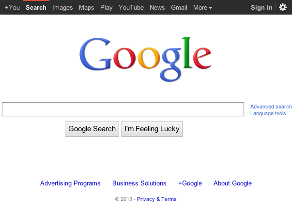
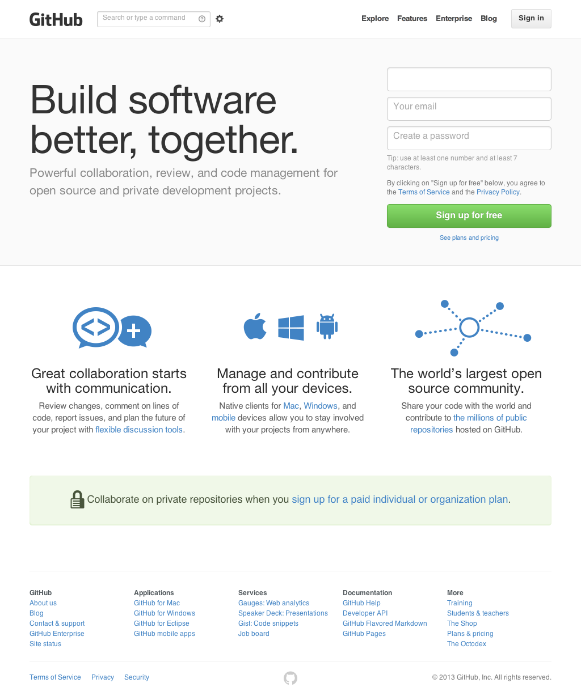

# Automated Testing for Javascript
by Achim Staebler [@asmod3us](http://twitter.com/@asmod3us)

## Motivation
"It used to work in the last spring."

- environments are complex
- deliver deliver high-quality, tested coded
- 100% coverage!

## Prerequisites
[NodeJS](http://nodejs.org/)

	$ node -e 'console.log("hello world!");'
	hello world!

grab the code from github

	$ git clone https://github.com/asmod3us/jstesting
	
install dependencies with npm

	$ npm install

## Mobile Apps
Apple's [UI Automation framework](http://developer.apple.com/library/ios/#documentation/DeveloperTools/Reference/UIAutomationRef/_index.html) uses Javascript.

- we have Javascript and native code, but
- can run most of the app in a browser
- we also have parts that depend on a native environment

## How to run tests
Many test runners and frameworks available for NodeJS:

- [intern](http://theintern.io/)
- [karma](http://karma-runner.github.io/) (fka testacular)
- [testem](https://github.com/airportyh/testem)
- [jasmine](https://github.com/airportyh/testem)
- [mocha](http://visionmedia.github.io/mocha/)

We chose mocha because of its flexibility and async support.

## How to write unit tests
- different styles: BDD, TDD, … use any you like!
- ideally, you would write tests first and then start developing a feature!

## BDD
*Given* [1, 2,3]

*When* a number is not present in the array

*Then* indexOf should return -1 for it

	var should = require('should');
	describe('Array', function(){
	  describe('#indexOf()', function(){
	    it('should return -1 when not present', function(){
	      [1,2,3].indexOf(4).should.equal(-1);
	    });
	  });
	});

	$ mocha -R spec bdd.js 
		  Array
		    #indexOf()
		      ✓ should return -1 when not present 
		
		
		  1 test complete (6 ms)

## TDD

	var assert = require("assert");
	describe('Array', function(){
	  describe('#indexOf()', function(){
	    it('should return -1 when the value is not present', function(){
	      assert.equal(-1, [1,2,3].indexOf(4));
	    })
	  })
	})
	
	$ mocha -R spec tdd.js 

## What to test
- functionality:
	* is 91 really a prime?
	* does the user model really save my changes?
- behaviour and user experience:
	* is the page title correct?
	* if a user swipes over a page, will the app navigate back?
	* if a user logs out, is the session cookie invalidated?

## Where to test
- unit tests running without DOM in node
- acceptance tests running in a browser
- acceptance tests running in a device simulator or on a real device

## How to write acceptance tests
- Selenium provides a webdriver api for writing tests
- test implementation is independent of the runtime where it is actually executed.

## WebDriver API
If you know selenium, this will look familiar. Look at the [API docs](http://selenium.googlecode.com/git/docs/api/java/index.html).
Example in Javascript:

	…
	client.getTitle().then(function(title){
		expect(title).to.equal('Google');
		done();
	});
	…

## How to run acceptance tests?
- Selenium Grid (complex setup)
- Saucelabs
- your own browsers, locally

or

phantomjs, a headless webkit browser

## PhantomJS
- run UI tests from the command line
- faster, because it skips the rendering part
- happens to implement webdriver protocol:

		phantomjs --webdriver=4444 &

## How to run acceptance tests with mocha
Requires phantomjs running in the background to provide the webdriver, ie

	$ npm run-script webdriver
	$ mocha -R spec title.js
	…
	    ✓ should see the correct title

Proof you say?

## How to create screenshots with webdriver

	client.takeScreenshot().then(function(data){
		var base64Data = data.replace(/^data:image\/png;base64,/,"")
		fs.writeFile("google.png", base64Data, 'base64', function(err) {
			if(err) {
				console.log(err);
			}
		});
	});
	
	$ mocha -R spec title.js

## How to create screenshots with phantomjs
PhantomJS not only implements the WebDriver protocol, it also has its own API:

	var page = require('webpage').create();
	page.viewportSize = { width: 1024, height: 768 };
	page.zoomFactor = 1;

	page.open('http://github.com/', function() {
		page.render('github.png');
		phantom.exit();
	});

	$ phantom pic.js

## PhantomJS APIs vs WebDriver
- if you stick to WebDriver APIs you can
	* easily switch your tests to run on a Selenium grid later
	* switch to run on multiple real browsers supported by Selenium drivers
- if you don't need that PhantomJS has richer APIs
	* also look at [CasperJS](http://casperjs.org/)

## How to test mobile apps
For web-based, hybrid and native apps, there is a subset of the WebDriver protocol called the [JSON Wire Protocol](https://code.google.com/p/selenium/wiki/JsonWireProtocol).

[Appium](http://appium.io/) from [SauceLabs](https://saucelabs.com/) provides an [implementation](https://github.com/appium/appium/wiki/JSON-Wire-Protocol:-Supported-Methods).
Its awesomeness is best experienced in a demo!

## appium demo
You will need a Mac with XCode for this! Appium needs to be running in the background:

	$ appium &

or

	$ npm run-script appium

Automate a native app:

	$ node demo.js

Automate a hybrid app:

	$ node hybrid.js

## Contact
Connect with <a href="mailto:sta@de.ibm.com">Achim Staebler</a> on [LinkedIn](http://linkedin.com/in/astaebler).

Follow him on [Twitter](http://twitter.com/@asmod3us).
